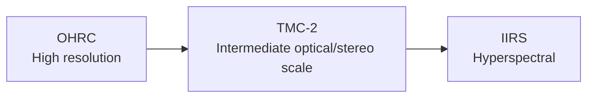
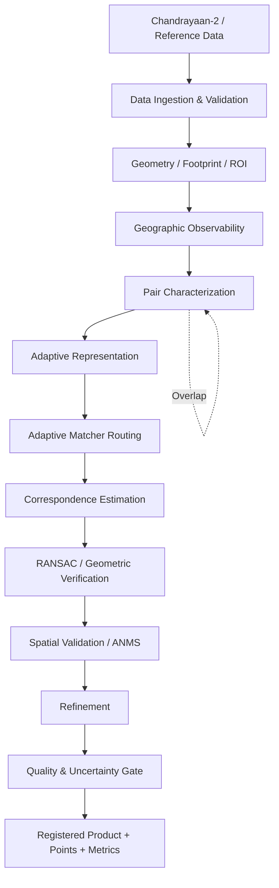
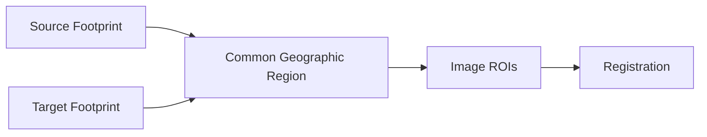
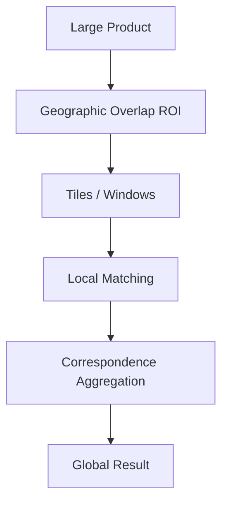
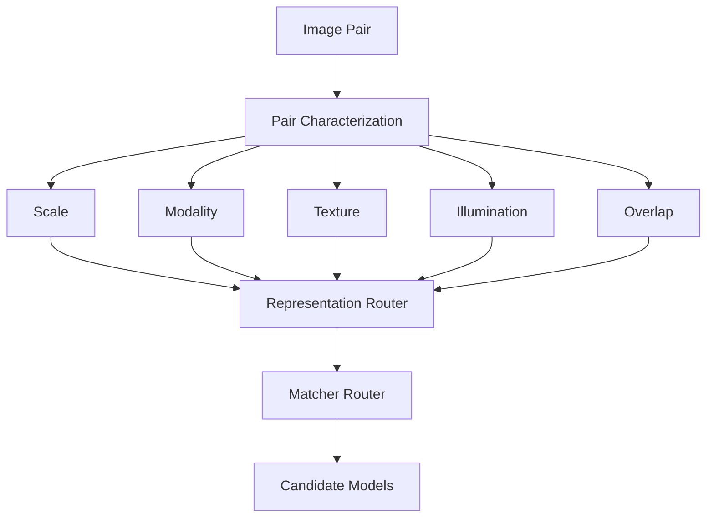
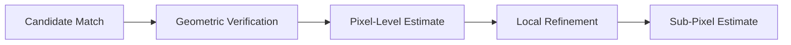
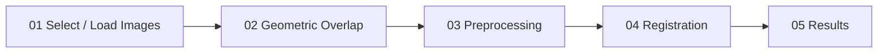

# PARALLAX

   

## Multi-Modal, Sun-Angle & Scale-Invariant Image Correspondence for Chandrayaan-2

PARALLAX is an adaptive lunar image correspondence and registration framework designed for heterogeneous Chandrayaan-2 optical datasets. Its objective is to identify points representing the same physical lunar locations across images that differ in **sensor modality, Sun angle/illumination, viewing geometry, and spatial scale**, then use those correspondences to estimate and validate geometric alignment.

> **Research status:** PARALLAX is an active research and engineering prototype. Implemented components, components under integration, and proposed research directions are explicitly distinguished below. Current experiments do not constitute a claim of universally successful real-world cross-sensor registration.

---

## 1. Problem

Chandrayaan-2 provides complementary observations of the lunar surface:

| Instrument | Type | Approx. project scale | Main information |
|---|---|---:|---|
| **OHRC** | High-resolution panchromatic optical | ~0.25 m/pixel | Detailed morphology |
| **TMC-2 / TMC** | Panchromatic stereo | ~5 m/pixel | Terrain / stereo information |
| **IIRS** | Hyperspectral | ~80 m/pixel | Spectral / mineralogical information |

The same crater, ridge, boundary, or terrain structure can appear substantially different between these instruments. PARALLAX therefore treats registration as a **multimodal, illumination-aware and scale-aware correspondence problem**, rather than as simple image-to-image matching.

The project addresses the SIH26166 objective:

> **Multi-modal, Sun angle and scale invariant image correspondence using Chandrayaan-2 optical images (OHRC, TMC and IIRS).**

---

## 2. Three Core Challenges

### Multi-modal variation
OHRC/TMC-2 are primarily optical/panchromatic datasets, while IIRS is hyperspectral (~800–5000 nm). Identical terrain can therefore have very different intensity and spectral appearance.

### Sun-angle variation
Different solar elevation and azimuth change highlights, shadows, local contrast and apparent boundaries. PARALLAX allows solar-geometry-aware processing where metadata supports it, together with normalization, shadow handling and confidence reduction for unreliable regions.

### Scale variation
The project specification describes an approximate OHRC–TMC-2–IIRS scale range of 0.25 m to 80 m/pixel, creating an approximately 320× nominal scale gap between OHRC and IIRS.

---

## 3. PARALLAX Principle

PARALLAX follows a geometry-first, adaptive registration workflow.

```mermaid
flowchart LR
    A[Data] --> B[Geometry / Observability]
    B --> C[Overlap ROI]
    C --> D[Pair Characterization]
    D --> E[Adaptive Representation]
    E --> F[Adaptive Matcher]
    F --> G[Correspondences]
    G --> H[RANSAC / Verification]
    H --> I[Spatial Validation]
    I --> J[Sub-pixel Refinement]
    J --> K[Quality + Uncertainty]
    K --> L[Registered Product]
```



**Core principle:** geometry before correspondence, adaptation before matching, and verification before acceptance.


---

## 4. TMC-2 Bridge Strategy

Direct OHRC ↔ IIRS correspondence has an extreme scale and modality gap. PARALLAX therefore proposes a hierarchical bridge:



TMC-2 can provide an intermediate representation through which correspondence may potentially be propagated between high-resolution OHRC and lower-resolution IIRS.

This is a **research strategy to be experimentally validated**, not a guaranteed solution.


---

## 5. System Architecture



### Processing stages

| Stage | Purpose |
|---|---|
| **Data ingestion** | Discover products, metadata, image data and geometry |
| **Geometry** | Establish geographic observability and derive valid ROIs |
| **Characterization** | Estimate scale, modality, texture, illumination and overlap |
| **Adaptive routing** | Select representation and correspondence model |
| **Correspondence** | Generate candidate image correspondences |
| **Verification** | Estimate transformation and reject inconsistent matches |
| **Spatial validation** | Check coverage and spatial distribution |
| **Refinement** | Improve correspondence localization where supported |
| **Quality gate** | Combine accuracy, coverage, confidence and uncertainty |
| **Output** | Produce validated registration information and provenance |


---

## 6. Data Ingestion

PARALLAX uses mission products and metadata rather than treating all inputs as ordinary images.

The ingestion layer is designed to handle:

- product discovery
- sensor identification
- PDS metadata
- image dimensions and data types
- acquisition information
- geometry files
- window-based image access
- input validation

Supported/researched input families include:

- **PDS4** for Chandrayaan-2
- **PDS3** for reference datasets
- **GeoTIFF**
- standard image formats for testing/fallback

### Current development dataset scope

The current cross-sensor development/validation work is restricted to:

```text
IIRS
ch2_iir_nci_20221209T1908498944_d_img_n18

OHRC
ch2_ohr_ncp_20250612T2031048828_d_img_d18

TMC-2
ch2_tmc_ncn_20230605T1503198538_d_img_n18
```

These are the current development datasets, not evidence of full-archive validation.

---

## 7. Geometry-First Observability

PARALLAX first determines whether two products observe a common geographic region.



The geometry layer supports:

- latitude/longitude grids
- scan/pixel coordinates
- geographic bounds
- geographic-to-pixel mapping
- pixel-to-geographic lookup
- footprint overlap
- ROI discovery

If no valid overlap exists, the system should reject the pair rather than fabricate correspondences.


---

## 8. Preprocessing

PARALLAX uses sensor-aware preprocessing.

### Radiometric / appearance processing

Depending on available metadata and selected representation:

- relative normalization
- percentile normalization
- contrast normalization
- gradient representation
- spectral representation
- illumination-aware processing
- shadow handling

### Geometric processing

The architecture supports:

- orientation handling
- comparable ROI extraction
- resampling
- geometry-aware ROI selection
- distortion-aware processing when metadata permits

---

## 9. IIRS Representations

IIRS is a hyperspectral cube. PARALLAX can convert it to suitable 2-D representations for downstream matching:

```text
IIRS
├── Native / selected spectral band
├── Spectral mean
└── Spectral gradient
```

The representation router can select a representation based on the image pair rather than forcing all matchers to process the full hyperspectral cube.

---

## 10. Multi-Scale Processing

Large resolution differences require scale-aware processing.



The architecture includes:

- image pyramids
- scale-aware windows
- coarse-to-fine matching
- sensor-pair-dependent scaling
- ROI-based processing
- overlapping tiles

Large products should not be loaded entirely into RAM.


---

## 11. Feature Extraction and Matching

PARALLAX supports multiple correspondence families.

### Classical

- **SIFT** — baseline feature detector/descriptor
- **RIFT** — modality/intensity-robust representation
- **HOPC** — structural descriptor
- **CFOG** — gradient/structure-based descriptor

### Learned

- **LoFTR** — detector-free transformer correspondence
- **SuperPoint + LightGlue** — learned keypoints and matching

The broader research architecture also considers:

- SuperGlue
- D2-Net
- other CNN/Transformer feature-learning approaches

Model choice is intended to be adaptive rather than universally fixed.

---

## 12. Adaptive Representation and Matcher Routing

PARALLAX separates **representation selection** from **matcher selection**.



This allows different sensor combinations to use different representations and correspondence algorithms.


---

## 13. Multi-Modal Fusion / Common Embedding

The broader architecture allows a future common embedding space:

```text
OHRC ──► Encoder ──┐
                   │
TMC-2 ─► Encoder ──┼──► Common Feature Space
                   │
IIRS ──► Encoder ──┘
```

The purpose is to reduce modality-specific appearance differences before correspondence estimation.

Common embedding / learned fusion is a **research direction** and should not be interpreted as a fully trained or validated component of the current repository.

Mutual-information-based similarity is also part of the broader research direction for strongly multimodal cases.

---

## 14. Geometric Verification

Candidate matches are not accepted solely because a matcher produced them.

PARALLAX applies robust geometric verification using RANSAC-based estimation.

It evaluates:

- candidate matches
- inliers/outliers
- transformation
- reprojection error
- inlier ratio

The current pipeline supports affine/homography-style verification, with more local models possible where justified.

---

## 15. Spatially Distributed Correspondences

A transformation supported by a cluster of points may be unstable.

PARALLAX therefore evaluates:

- source coverage
- target coverage
- spatial distribution
- uniformity
- clustering

ANMS is part of the architecture for spatially distributed point selection.

A grid-based strategy can serve as a fallback.

---

## 16. Sub-Pixel Refinement

After geometric verification, local refinement can improve correspondence localization.



The architecture includes:

- local correlation refinement
- ECC / inverse-compositional alignment
- sub-pixel localization

Sub-pixel accuracy is a **project target/research objective**, not a blanket claim about current real-data results.


---

## 17. Quality Gate and Uncertainty

PARALLAX is designed to reject unreliable registrations.

Relevant measurements include:

- candidate matches
- inlier matches
- outlier matches
- inlier ratio
- RMSE
- mean/median/max error
- spatial coverage
- uniformity
- confidence
- uncertainty
- precision
- recall
- F1

Quality states include:

```text
PASSED
WARNING
FAILED
CONDITIONAL_BRIDGE
```

The system should communicate uncertainty instead of treating every numerical transformation as equally reliable.

---

## 18. Outputs

A completed run is intended to provide:

```text
Registration Result
├── Registered image
├── Correspondence points
├── Transformation parameters
├── Inlier / outlier information
├── Reprojection errors
├── Spatial coverage
├── Confidence
├── Uncertainty
├── Quality decision
└── Processing provenance
```

Broader scientific outputs can support:

- lunar maps
- GIS-compatible products
- cross-instrument analysis
- exported correspondence datasets

---

## 19. Evaluation Metrics

The supplied project specification defines these targets:

| Metric | Target |
|---|---:|
| RMSE / reprojection error | < 1 pixel |
| Inlier count | > 100 |
| Inlier ratio | > 0.5 |
| Precision | > 0.8 |
| Recall | > 0.5 |
| F1 score | > 0.6 |
| Spatial coverage | Uniform distribution |
| Processing time | < 3 min for 2000×2000 images |

**These are project targets, not experimentally established results.**

---

## 20. Ground Truth and Validation

### Controlled / synthetic validation

A known transformation can be applied to an image:

```text
Original
   ↓
Known rotation / scale / translation
   ↓
Controlled pair
   ↓
PARALLAX
   ↓
Estimated transformation
   ↓
Compare with known ground truth
```

Controlled tests can evaluate:

- correspondence accuracy
- transformation error
- scale robustness
- rotation robustness
- illumination sensitivity
- refinement accuracy

### Real lunar validation

Where exact point-level ground truth is unavailable:

- geometric consistency
- reprojection error
- spatial distribution
- reference imagery
- cross-validation

can be used as complementary evidence.

---

## 21. Current Validation Status

The current implementation has been exercised through:

- PDS4 ingestion
- product abstraction
- sensor adapters
- geometry ingestion
- geographic overlap
- ROI projection
- sensor-aware preprocessing
- adaptive routing
- multiple matcher implementations
- RANSAC verification
- spatial validation components
- refinement components
- quality assessment
- persistent preprocessing
- FastAPI backend development

A controlled TMC-2 test has demonstrated recovery of a known synthetic/local transformation.

For the current real TMC-2 ↔ IIRS investigation, geometry identifies overlapping regions, but current real-data candidate tests have **not yet demonstrated reliable cross-sensor registration at the required scientific quality**. A current LoFTR saved-ROI experiment produced candidate matches, but only a small fraction survived geometric verification.

Therefore the current status is:

> **A functioning registration research pipeline under active validation, not a claim of solved universal Chandrayaan-2 cross-sensor registration.**

---

## 22. Edge Cases

| Situation | Intended handling |
|---|---|
| No overlap | Reject before matching |
| Invalid geometry | Reject or request another ROI |
| Deep/permanent shadow | Reduce confidence / exclude |
| Low texture | Try dense/learned methods |
| Extreme scale | Multi-scale / bridge strategy |
| Strong modality difference | Modality-aware representation |
| Clustered matches | ANMS / spatial filtering |
| Insufficient RANSAC support | Reject |
| Poor spatial coverage | Reject / conditional result |
| Missing metadata | Use available information and report limitation |
| Very large image | Window/tile processing |

---

## 23. Large-Image Engineering

Planetary images can be extremely large, so PARALLAX favors:

```text
Product
  ↓
Geometry
  ↓
Overlap ROI
  ↓
Overlapping tiles/windows
  ↓
Local processing
  ↓
Correspondence aggregation
  ↓
Final transformation/product
```

This is intended to reduce memory usage and support practical processing rather than limiting the system to small demonstration images.

---

## 24. Backend

PARALLAX uses a Python/FastAPI backend.

The intended service flow is:

```text
POST /api/geometry/validate
            ↓
       Observable ROI
            ↓
POST /api/preprocess
            ↓
      Persistent run
            ↓
GET /api/preprocess/{run_id}
            ↓
POST /api/register/{run_id}
            ↓
Correspondence + Verification
            ↓
Metrics + Quality
```

The backend separates:

- ingestion
- geometry
- preprocessing
- correspondence
- verification
- result generation

so individual stages can be tested independently.

---

## 25. Persistent Preprocessing

Preprocessed data is stored before registration so that expensive preprocessing does not need to be repeated.

```text
data/
└── preprocessed/
    └── <run_id>/
        ├── source/
        │   ├── image.npy
        │   └── metadata.json
        ├── target/
        │   ├── image.npy
        │   └── metadata.json
        └── manifest.json
```

The manifest records the processing context and selected representations.


---

## 26. Frontend Workflow

The frontend mirrors the scientific pipeline rather than presenting registration as a single black-box action.



| Page / Stage | Main purpose |
|---|---|
| **01 — Select / Load** | Choose source and target products |
| **02 — Geometric Overlap** | Confirm common geographic observability |
| **03 — Preprocessing** | Select representation and inspect processed imagery |
| **04 — Registration** | Run routing, correspondence, verification and refinement |
| **05 — Results** | Inspect matches, transformation, metrics, quality and uncertainty |


---

## 27. Docker

The backend includes Docker support for a reproducible runtime.

Build:

```bash
docker compose build
```

Run:

```bash
docker compose up
```

Health check:

```bash
curl http://localhost:8000/api/health
```

Large mission datasets should be mounted into the container rather than baked into the Docker image.

---

## 28. Local Development

### Requirements

- Python 3.11+
- Git
- Docker Desktop
- Chandrayaan-2 PDS4 data for actual processing

### Setup

```bash
git clone <repository-url>
cd parallex
python -m venv .venv
```

Windows:

```powershell
.venv\Scripts\Activate.ps1
```

Install:

```powershell
pip install -r requirements.txt
```

Set source path:

```powershell
$env:PYTHONPATH="$PWD\src"
```

Run backend:

```powershell
python -m uvicorn parallex.api.app:app --reload --host 127.0.0.1 --port 8000
```

---

## 29. Testing

Run:

```powershell
pytest -q
```

Compile-check:

```powershell
python -m compileall src\parallex
```

Docker:

```powershell
docker compose exec parallex-backend pytest -q
```

---

## 30. Repository Structure

```text
PARALLAX/
├── src/parallex/
│   ├── api/                 # FastAPI backend
│   ├── products/            # Generic product abstraction
│   ├── sensors/             # IIRS / OHRC / TMC-2 adapters
│   ├── io/                  # Image and ROI access
│   ├── pds4/                # PDS4 metadata and readers
│   ├── geometry/            # Geometry adapter
│   ├── overlap/             # Geographic overlap
│   ├── preprocessing/       # Sensor-aware preprocessing
│   ├── characterization/    # Pair characterization
│   ├── routing/             # Representation + matcher routing
│   ├── matching/            # Correspondence algorithms
│   ├── verification/        # RANSAC / geometric validation
│   ├── refinement/          # Refinement stages
│   ├── spatial/             # Spatial validation
│   ├── validation/          # Tests and validation
│   └── pipeline/            # End-to-end orchestration
├── data/preprocessed/       # Persistent preprocessing runs
├── scripts/                 # Development / experiment scripts
├── tests/                   # Automated tests
├── requirements.txt
├── requirements-dev.txt
├── Dockerfile
├── docker-compose.yml
└── README.md
```


---

## 31. Software Design Principles

### Geometry before correspondence
Do not match regions that are not geographically observable.

### Adaptation before matching
Select representations and models according to the image pair.

### Verification before acceptance
A matcher output is not automatically a valid registration.

### Failure is a valid result
Insufficient evidence should produce an explicit failure/conditional result rather than fabricated matches.

### Sensor-aware processing
IIRS, OHRC and TMC-2 are not treated as interchangeable image sources.

### Reproducibility
Representations, transformations, metrics, processing metadata and provenance should be retained.

### Scalable processing
Large products should use ROIs, windows and tiles.

---

## 32. Innovation

PARALLAX combines:

1. Multimodal registration specifically targeting OHRC, TMC-2 and IIRS
2. Geometry-first observability
3. TMC-2 intermediate bridging for extreme scale/modality gaps
4. Physics-aware illumination/shadow considerations
5. Adaptive representation selection
6. Adaptive matcher routing
7. Coarse-to-fine multi-scale processing
8. Classical and learned correspondence methods
9. Robust geometric verification
10. Spatially distributed correspondence selection
11. Sub-pixel refinement
12. Confidence and uncertainty reporting
13. Synthetic ground-truth validation
14. Large-image/tile-based processing
15. Persistent preprocessing and reproducible processing runs

---

## 33. Scientific Value

If the required registration accuracy is demonstrated, registered observations can combine complementary information:

```text
OHRC  → Detailed morphology
TMC-2 → Stereo / terrain information
IIRS  → Spectral / mineralogical information
```

Potential applications include:

- geological analysis
- mineral mapping
- terrain characterization
- landing-site analysis
- cross-mission comparison
- lunar mapping
- multi-instrument scientific interpretation

These are intended applications and require appropriate accuracy validation on real datasets.

---

## 34. Research Areas

- Image registration and geometric alignment
- Feature detection, description and matching
- Multimodal correspondence
- CNN/Transformer feature learning
- SIFT, RIFT, HOPC, CFOG
- SuperPoint, SuperGlue, LightGlue and LoFTR
- RANSAC
- ECC / inverse-compositional alignment
- ANMS
- Lunar illumination and shadow modeling
- Photometric/BRDF considerations
- Chandrayaan-2 and reference lunar imagery
- Adaptive model routing

---

## 35. Implementation Status

### Implemented / available

- [x] PDS4 product discovery and metadata extraction
- [x] Window-based image readers
- [x] Generic product abstraction
- [x] IIRS / OHRC / TMC-2 adapters
- [x] Geometry ingestion
- [x] Geographic overlap analysis
- [x] Geographic-to-pixel projection
- [x] ROI/window processing
- [x] Sensor-aware preprocessing
- [x] IIRS representations
- [x] Representation routing
- [x] Adaptive matcher routing
- [x] SIFT
- [x] RIFT
- [x] HOPC
- [x] CFOG
- [x] LoFTR
- [x] SuperPoint + LightGlue
- [x] RANSAC verification
- [x] Spatial validation components
- [x] Refinement pipeline components
- [x] Quality-gate framework
- [x] Persistent preprocessing
- [x] FastAPI backend foundation
- [x] Docker runtime setup

### In progress

- [ ] Fully generic geometry-derived preprocessing ROI
- [ ] Complete geometry validation API
- [ ] Preprocessing API
- [ ] Registration API
- [ ] Full frontend/backend integration
- [ ] Broader real-data benchmarking
- [ ] Quantitative cross-sensor benchmark
- [ ] End-to-end scientific validation

### Research / proposed

- [ ] Full TMC-2 bridge validation
- [ ] Learned common embedding
- [ ] Multimodal fusion
- [ ] Learned adaptive routing
- [ ] Uncertainty calibration
- [ ] Synthetic training dataset generation
- [ ] Large-scale parameter search and ablation
- [ ] Optimized GPU/cloud inference

---

## 36. Future Work

The longer-term roadmap includes:

- broader Chandrayaan-2 archive validation
- stronger real-data cross-sensor benchmarks
- experimental validation of the TMC-2 bridge
- common multimodal feature spaces
- improved learned routing
- uncertainty calibration
- synthetic training data
- large-scale benchmarking and ablation
- optimized GPU inference
- cloud-scale processing
- integration of additional reference lunar datasets

---

## 37. One-Sentence Definition

> **PARALLAX is an adaptive, geometry-constrained lunar image correspondence and registration framework that seeks reliable, spatially distributed and quantitatively validated correspondences across Chandrayaan-2 OHRC, TMC-2 and IIRS imagery despite differences in modality, illumination, viewing geometry and scale.**

---

## 38. Quick Summary

```text
1. CHECK GEOMETRY
   Is there a common lunar region?

2. PREPROCESS
   Make the sensor pair comparable.

3. CHARACTERIZE
   Measure scale, modality, texture and difficulty.

4. ROUTE
   Select representation + correspondence model.

5. MATCH
   Generate candidate correspondences.

6. VERIFY
   RANSAC + geometric consistency.

7. DISTRIBUTE
   Ensure useful spatial coverage.

8. REFINE
   Improve localization where supported.

9. QUALITY-GATE
   Measure error, coverage, confidence and uncertainty.

10. OUTPUT
    Registered product + correspondences + transformation + metrics.
```

**PARALLAX — from geographic observability to validated lunar correspondence.**
