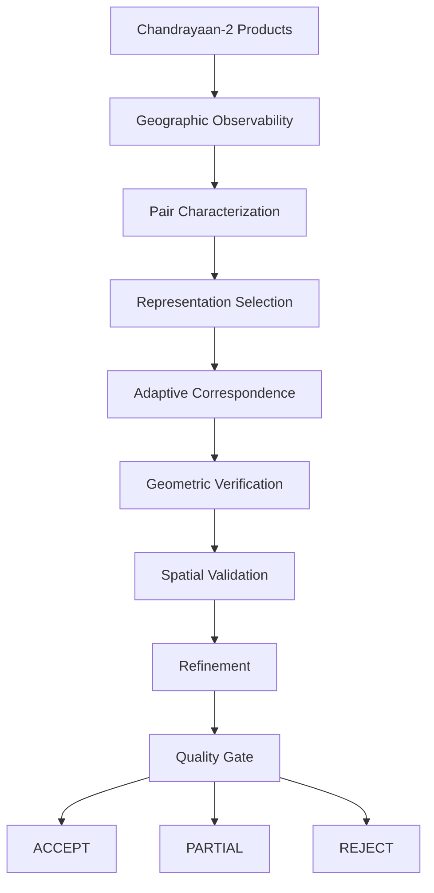

# PARALLAX


**Adaptive Lunar Image Correspondence and Registration**

PARALLAX is an adaptive correspondence and registration framework for heterogeneous Chandrayaan-2 imagery from **OHRC**, **TMC-2** and **IIRS**.

Instead of applying one fixed matching algorithm to every pair, PARALLAX treats registration as a **pair-specific decision problem**: it establishes geographic observability, characterizes the pair, selects representations and matchers, independently verifies the matches, and only then accepts a registration.



---

## Table of Contents

- [Problem](#problem)
- [Approach](#approach)
- [Processing Workflow](#processing-workflow)
- [Key Components](#key-components)
- [Supported Pairs](#supported-pairs)
- [Implementation Status](#implementation-status)
- [Repository Structure](#repository-structure)
- [Getting Started](#getting-started)
- [Testing](#testing)
- [Validation](#validation)
- [Design Principles](#design-principles)
- [Roadmap](#roadmap)
- [Project Definition](#project-definition)

---

## Problem

The same lunar terrain can look very different across instruments.

| Instrument | Primary information                   | Approx. scale |
| ---------- | ------------------------------------- | ------------- |
| OHRC       | High-resolution morphological detail  | ~0.25 m/px    |
| TMC-2      | Panchromatic / stereo terrain data    | ~5 m/px       |
| IIRS       | Hyperspectral information             | ~80 m/px      |

**Key challenges**

- Large spatial-scale differences
- Cross-sensor modality differences
- Sun-angle and illumination variation
- Different viewing geometries
- Shadow and appearance changes
- Differences in texture and feature availability
- Large image sizes and geographic search spaces

---

## Approach

PARALLAX treats every image pair as a distinct correspondence problem and considers:

- Sensor identity and relative spatial scale
- Geographic overlap and valid image regions
- Illumination, viewing geometry and shadows
- Texture and structural information
- Available geometric information
- Computational requirements

These determine whether correspondence is feasible and which strategy should be evaluated.

---

## Processing Workflow

| Step | Stage         | Description                                                    |
| ---- | ------------- | -------------------------------------------------------------- |
| 01   | Observe       | Determine whether the products share a geographic region       |
| 02   | Characterize  | Estimate pair properties and difficulty                        |
| 03   | Represent     | Select a sensor-aware representation                           |
| 04   | Route         | Select or rank feasible correspondence strategies              |
| 05   | Match         | Generate candidate correspondences                             |
| 06   | Verify        | Estimate geometric consistency; identify reliable matches      |
| 07   | Validate      | Evaluate spatial coverage and distribution                     |
| 08   | Refine        | Improve correspondence localization where supported            |
| 09   | Quality-Gate  | Combine correspondence, geometric and spatial evidence         |
| 10   | Output        | Produce registration with quality and processing provenance    |

---

## Key Components

### 1. Geometry Before Correspondence

The geometry layer determines whether two products observe a common region and derives a usable ROI. If meaningful overlap cannot be established, matching is rejected before expensive computation.

- Geographic bounds and footprint overlap
- Latitude/longitude information
- Geographic-to-pixel and pixel-to-geographic mapping
- ROI discovery and window-based processing

### 2. Pair Characterization

Builds a pair descriptor from scale, modality, illumination, geometry/overlap, texture and shadows, yielding a **pair difficulty** estimate used by the correspondence layer.

### 3. Sensor-Aware Representation

Sensors are not treated as interchangeable. For IIRS, available representations are:

- Selected spectral band
- Spectral mean
- Spectral gradient

Other processing: relative/contrast normalization, gradient representations, illumination-aware and shadow handling, multi-scale and coarse-to-fine processing, ROI-based processing.

### 4. Adaptive Correspondence

Representation selection is separated from matcher selection. All matchers share a common interface so they are evaluated under the same verification and quality framework.

| Type    | Methods                                                  |
| ------- | -------------------------------------------------------- |
| Classical | SIFT, RIFT, HOPC, CFOG                                 |
| Learned   | LoFTR, SuperPoint + LightGlue, SuperPoint + SuperGlue  |

### 5. Geometric Verification

Many points do not imply a valid registration. Verification evaluates candidate correspondences, inliers/outliers, transformation consistency, RANSAC support, reprojection error, inlier ratio and spatial distribution.

### 6. Spatial Validation

A consistent transformation can still be poorly supported if matches cluster in a small part of the ROI. PARALLAX evaluates source/target coverage, distribution, clustering and uniformity. ANMS-based selection can improve spatial support.

### 7. Quality-Gated Registration

A registration result contains correspondence points, inlier/outlier information, transformation parameters, reprojection errors, spatial coverage, confidence, uncertainty, quality decision and processing provenance.

| Decision    | Meaning                                                            |
| ----------- | ------------------------------------------------------------------ |
| **ACCEPT**  | Sufficient evidence for the configured quality criteria            |
| **PARTIAL** | Useful correspondence exists, but evidence is incomplete           |
| **REJECT**  | Evidence is insufficient for a reliable registration               |

If one route fails verification, another feasible strategy can be evaluated. A registration is never forced when evidence is insufficient.

### 8. TMC-2 Bridge Strategy

Direct OHRC→IIRS matching involves extreme scale and modality gaps. PARALLAX investigates whether TMC-2 can serve as an intermediate representation:

```text
OHRC → TMC-2 → IIRS
```

This is an adaptive research strategy, not a mandatory step. Its effectiveness is to be evaluated experimentally against direct OHRC–IIRS correspondence.

### 9. Benchmarking and Future Adaptive Routing

Experiments are recorded as structured benchmark records:

```text
Image Pair → Pair Characteristics → Representation + Method → Correspondence
          → Verification Metrics (error, inliers, coverage, runtime, failure reason)
          → Benchmark Record → Future Adaptive Routing
```

The goal is to move from manually configured strategies toward evidence-driven method selection.

### 10. Large-Image Processing

Products are processed through geographic ROIs, windows and tiles rather than loaded fully into memory:

```text
Product → Geographic Overlap → Valid ROI → Windows/Tiles
        → Local Processing → Correspondence Aggregation → Final Registration
```

### 11. Persistent Processing

Expensive preprocessing is stored as reproducible runs:

```text
data/preprocessed/<run_id>/
├── source/
│   ├── image.npy
│   └── metadata.json
├── target/
│   ├── image.npy
│   └── metadata.json
└── manifest.json
```

The manifest records context and selected representations for reproducibility.

---

## Supported Pairs

```text
OHRC  ↔ OHRC
OHRC  ↔ TMC-2
TMC-2 ↔ TMC-2
TMC-2 ↔ IIRS
OHRC  ↔ IIRS
IIRS  ↔ IIRS
```

Subject to spatial compatibility and data availability. Reference lunar datasets can be incorporated where appropriate.

---

## Implementation Status

### Implemented

- PDS4 product discovery and metadata extraction
- Generic product abstraction
- OHRC / TMC-2 / IIRS sensor adapters
- Geometry ingestion, geographic overlap, geographic-to-pixel projection
- ROI and window processing
- Sensor-aware preprocessing and IIRS representations
- Representation routing and adaptive matcher routing
- Matchers: SIFT, RIFT, HOPC, CFOG, LoFTR, SuperPoint + LightGlue
- RANSAC verification
- Spatial validation and refinement components
- Quality-gate framework
- Persistent preprocessing
- FastAPI backend foundation
- Docker runtime

### In Progress

- Broader real-data benchmarking
- End-to-end frontend/backend integration
- Quantitative cross-sensor benchmark
- Expanded geometry-derived processing
- End-to-end scientific validation

### Research Directions

- TMC-2 bridge validation
- Learned common embedding and multimodal fusion
- Learned adaptive routing
- Uncertainty calibration
- Synthetic training data generation
- Large-scale benchmarking and ablation
- Optimized GPU/cloud inference

> Current development datasets include representative OHRC, TMC-2 and IIRS products. Broader archive validation is part of the ongoing benchmark process.

---

## Repository Structure

```text
PARALLAX/
├── src/parallex/
│   ├── api/                 # FastAPI backend
│   ├── products/            # Generic product abstraction
│   ├── sensors/             # IIRS / OHRC / TMC-2 adapters
│   ├── io/                  # Image and ROI access
│   ├── pds4/                # PDS4 metadata and readers
│   ├── geometry/            # Geometry processing
│   ├── overlap/             # Geographic overlap
│   ├── preprocessing/       # Sensor-aware preprocessing
│   ├── characterization/    # Pair characterization
│   ├── routing/             # Representation and matcher routing
│   ├── matching/            # Correspondence algorithms
│   ├── verification/        # Geometric validation
│   ├── refinement/          # Refinement stages
│   ├── spatial/             # Spatial validation
│   ├── validation/          # Tests and validation
│   └── pipeline/            # Pipeline orchestration
├── data/
│   └── preprocessed/        # Persistent preprocessing runs
├── scripts/                 # Development and experiment scripts
├── tests/                   # Automated tests
├── requirements.txt
├── requirements-dev.txt
├── Dockerfile
├── docker-compose.yml
└── README.md
```

---

## Getting Started

### Requirements

- Python 3.11+
- Git
- Docker Desktop (optional, for container runtime)
- Chandrayaan-2 PDS4 data for actual processing

### Local Setup

```bash
git clone <repository-url>
cd parallex

python -m venv .venv
```

Activate the environment:

```powershell
# Windows (PowerShell)
.venv\Scripts\Activate.ps1
```

```bash
# Linux / macOS
source .venv/bin/activate
```

Install dependencies and set the source path:

```bash
pip install -r requirements.txt
```

```powershell
# Windows (PowerShell)
$env:PYTHONPATH="$PWD\src"
```

```bash
# Linux / macOS
export PYTHONPATH="$PWD/src"
```

Run the backend:

```bash
python -m uvicorn parallex.api.app:app --reload --host 127.0.0.1 --port 8000
```

### Docker

```bash
docker compose build
docker compose up
```

Health check:

```bash
curl http://localhost:8000/api/health
```

> Mount large mission datasets into the container rather than baking them into the image.

---

## Testing

```bash
pytest -q                          # run test suite
python -m compileall src/parallex  # compile-check source
```

Inside Docker:

```bash
docker compose exec parallex-backend pytest -q
```

---

## Validation

### Controlled Validation

Apply a known transformation to an image, run it through PARALLAX, and compare the estimated transformation against ground truth. Evaluates correspondence accuracy, transformation error, scale and rotation robustness, illumination sensitivity and refinement behaviour.

### Real Lunar Validation

Where point-level ground truth is unavailable, evidence includes geometric consistency, reprojection error, spatial distribution, independent reference imagery, cross-validation and benchmark comparisons.

---

## Design Principles

| Principle                       | Meaning                                                                   |
| ------------------------------- | ------------------------------------------------------------------------- |
| Geometry before correspondence  | Do not match regions that are not geographically observable               |
| Adaptation before matching      | Choose representations and matchers per image pair                        |
| Verification before acceptance  | Producing points does not produce a valid registration                    |
| Failure is a valid result       | Insufficient evidence yields PARTIAL/REJECT, not an unreliable transform  |
| Sensor-aware processing         | OHRC, TMC-2 and IIRS are not interchangeable                              |
| Reproducibility                 | Retain context, representations, transformations, metrics and provenance  |
| Scalable processing             | Process large products via ROIs, windows and tiles                        |

---

## Roadmap

- Broader Chandrayaan-2 archive benchmarking
- Experimental validation of TMC-2 bridging
- Learned multimodal representations and common embedding space
- Learned adaptive routing and uncertainty calibration
- Synthetic ground-truth generation
- Large-scale parameter search and ablation
- Additional correspondence models and lunar reference datasets
- GPU and cloud-scale inference

**Potential applications:** lunar geological analysis, mineralogical interpretation, terrain characterization, landing-site analysis, lunar mapping, and integration of complementary Chandrayaan-2 observations. Suitability for each depends on the registration accuracy it requires.

---

## Project Definition

PARALLAX is an adaptive, geometry-constrained lunar image correspondence and registration framework that determines how heterogeneous Chandrayaan-2 observations should be compared, selects suitable correspondence strategies, independently verifies the resulting evidence, and produces a quality-gated registration result.

The long-term objective is to move from fixed correspondence pipelines toward an evidence-driven system that learns which registration strategies suit different lunar observation pairs.
